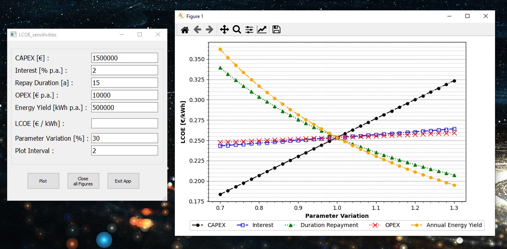

# LCOE_Calculator - plot sensitivities

A gui based application to visualize the sensitivity for levelized-cost-of
-electricity with python.

----------

## Requirements:

**DEPENDENCIES**

Development and testing was done with and WinOS:
- **matplotlib** 3.3.4
- **numpy** 1.20.1
- **PyQt5** 5.15.4

A multi platform application may need further adjustments.

----------
## Usage:

**EXECUTION**

Running main.py or gui.py will start the application and open the gui. Now
 users may plot the default values or use their own inputs. A new figure will
  be generated for each plot command. Further buttons allow to close all active
   figures or to directly exit the application.

The application runs until all generated instances (gui and plots) are closed. 
Therefore users should use the 'Exit App' button to close all windows and
 finish the program's runtime.
    

----------

## License & copyright

Copyright (c) 2021 mj0nez under MIT License

Permission is hereby granted, free of charge, to any person obtaining a copy
of this software and associated documentation files (the "Software"), to deal
in the Software without restriction, including without limitation the rights
to use, copy, modify, merge, publish, distribute, sublicense, and/or sell
copies of the Software, and to permit persons to whom the Software is
furnished to do so, subject to the following conditions:

The above copyright notice and this permission notice shall be included in all
copies or substantial portions of the Software.

THE SOFTWARE IS PROVIDED "AS IS", WITHOUT WARRANTY OF ANY KIND, EXPRESS OR
IMPLIED, INCLUDING BUT NOT LIMITED TO THE WARRANTIES OF MERCHANTABILITY,
FITNESS FOR A PARTICULAR PURPOSE AND NONINFRINGEMENT. IN NO EVENT SHALL THE
AUTHORS OR COPYRIGHT HOLDERS BE LIABLE FOR ANY CLAIM, DAMAGES OR OTHER
LIABILITY, WHETHER IN AN ACTION OF CONTRACT, TORT OR OTHERWISE, ARISING FROM,
OUT OF OR IN CONNECTION WITH THE SOFTWARE OR THE USE OR OTHER DEALINGS IN THE
SOFTWARE.

